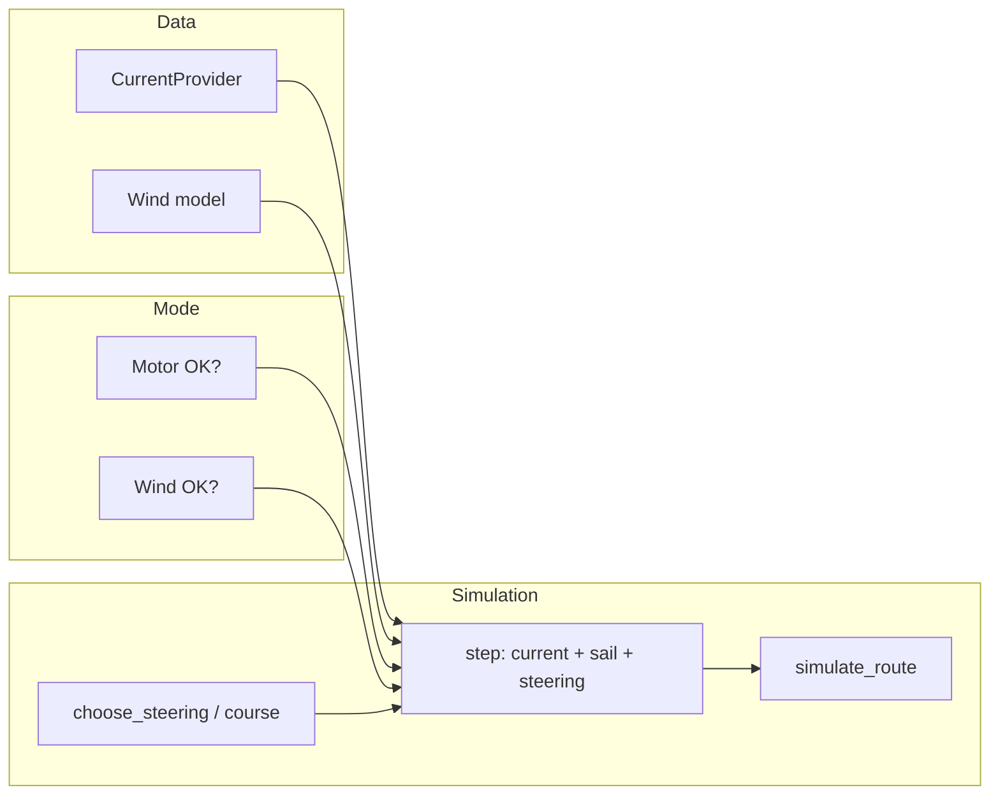

# Plan: Integrate update.md (wind + sail) into Blue Vector

## Context

[update.md](update.md) describes combining **ocean currents with wind (sail)** for low-energy maritime routing. Main ideas:

- **Alignment**: In North Pacific mid-latitudes (~30–45°N), westerlies and North Pacific Current both west→east → favorable for eastbound (e.g. China→LA).
- **Season**: Winter = best (strong westerlies + eastbound current); Spring/Fall = mixed; Summer = weak; **too far south** (<25–30°N) = trade winds + North Equatorial Current both east→west → "catastrophic."
- **Strategy**: Get north for westerlies, stay in eastbound corridor, avoid slipping south.
- **Energy**: Sail + current can push savings toward 99%+ (engine only for control).

The current system ([config.py](config.py), [data_loader.py](data_loader.py), [vessel_model.py](vessel_model.py), [router.py](router.py), [simulator.py](simulator.py)) uses **currents only**; there is no wind or sail.

---

## Resilience / Adaptive operation

**Core idea**: The system adapts to what's available. If the motor breaks, it uses wind (sail-only). If wind is out, it uses the motor. Both are optional resources; the vessel can run in degraded modes.

- **Motor failed** → Rely on **wind + current only**: no (or minimal emergency) propulsion; displacement = current + sail; router chooses course by picking the heading that best uses sail (e.g. among sail-effective directions) instead of steering thrust.
- **Wind out** → Rely on **motor + current**: current behavior; displacement = current + steering; sail contribution = 0.
- **Both available** → **Combined mode**: displacement = current + sail + steering; minimize propulsion by using sail when aligned, motor for corrections.
- **Neither** (drift-only) → Displacement = current only; no steering, no sail (emergency drift).

So the router and step logic are **mode-aware**: they use motor and/or wind depending on availability (config or simulated failure flags), and in sail-only mode "steering" becomes course selection for sail rather than thrust.

---

## Architecture (high level)

- **Mode**: At runtime, `motor_available` and `wind_available` (config or failure simulation) select behavior: combined, motor-only, sail-only, or drift-only.
- **Wind model**: Parametric by (lat, month): westerlies in 30–45°N, trade winds <25–30°N, weaker/variable in between and in summer. No new external data dependency.
- **Vessel**: `step()` gets (u_current, v_current), (u_wind, v_wind), and mode; adds **sail contribution** when wind available; adds **steering** when motor available; **propulsion energy** only when motor is used (∝ |steering|²).
- **Router**: In motor-only mode, same as today. In sail-only mode, "steering" is course choice (angle that maximizes sail along route); no thrust cost. In combined mode, minimizes propulsion using both sail and motor.
- **Reporting**: Total propulsion energy, % saved vs straight-line, **sail contribution**, and **mode** (combined / motor-only / sail-only) for transparency.

---

## 1. Wind model (parametric, seasonal + latitude)

- **New module** e.g. `wind_model.py`, or add to [data_loader.py](data_loader.py) as a separate concern.
- **API**: `get_wind(lat: float, lon: float, time: datetime) -> Tuple[float, float]` returning (u_wind, v_wind) in m/s (east, north).
- **Logic** (simplified, aligned with update.md):
  - **Latitude bands**: e.g. lat < 27° → trade winds (east→west, e.g. u ≈ -5 m/s); 27–45° → westerlies (west→east, u ≈ +5–10 m/s, stronger in winter); >45° → weaker/variable.
  - **Season**: Use `time.month` to scale magnitude (e.g. Nov–Mar = strong westerlies, Jun–Aug = weaker; trade winds more constant).
- **Config**: Add parameters for band boundaries (e.g. `TRADE_WIND_LAT_MAX = 27`, `WESTERLY_LAT_MIN = 30`, `WESTERLY_LAT_MAX = 45`) and nominal speeds, so the model can be tuned or disabled (e.g. `ENABLE_WIND = True`).

No OPeNDAP or new data files required; keeps offline-first behavior.

---

## 2. Vessel model: sail contribution and mode in `step()`

- **File**: [vessel_model.py](vessel_model.py).
- **Change**: Extend `step()` to accept optional wind, optional sail efficiency, and **motor availability**:
  - Signature: add `u_wind_ms: Optional[float] = None`, `v_wind_ms: Optional[float] = None`, `sail_efficiency: float = 0.0`, `motor_available: bool = True`.
  - **Sail vector**: When sail_efficiency > 0 and wind given, compute sail displacement per step (e.g. projection of wind onto heading, or fraction of wind vector). So:
    - `displacement = current*dt + (sail_contribution if wind_available else 0) + (steering*dt if motor_available else 0)`.
    - **Propulsion energy** only when motor_available: ∝ |steering_vector|²; when motor_available is False, steering_magnitude is forced to 0 (sail-only mode).
  - **Sail-only mode**: When motor_available is False, caller still passes a "course" angle (used for sail contribution); no thrust, so propulsion_energy_step = 0.
  - **Backward compatible**: If wind/sail disabled and motor_available True, behavior equals current implementation.
- **Optional**: Helper `sail_contribution_m_per_step(u_wind, v_wind, heading_deg, efficiency)` returning (dx_sail, dy_sail).

---

## 3. Data flow and mode wiring

- **Simulator** [simulator.py](simulator.py): Holds or receives `motor_available` and `wind_available` (from config or failure scenario). At each step: get currents; get wind if wind_available; call `step(..., motor_available=motor_available, u_wind=..., v_wind=..., sail_efficiency=... when wind_available)`. Track sail contribution for reporting. When motor_available is False, pass steering_magnitude=0 and use chosen "course" as sail heading.
- **Router** [router.py](router.py): Accepts `motor_available`, `wind_available`, and `get_wind`. In **motor-only** mode: same as today (sample steering angles, use step with sail=0). In **sail-only** mode: sample **course angles** (no thrust), step uses only current + sail for that course; cost = time + distance (no energy term, or energy=0). In **combined** mode: sample steering angles, step uses current + sail + steering; cost = energy + α*time + β*distance. So the router adapts its decision variable (thrust direction vs course direction) and cost by mode.
- **Provider abstraction**: Separate `get_wind(lat, lon, time)` (parametric); keep `get_currents` unchanged. Config: `MOTOR_AVAILABLE`, `WIND_AVAILABLE` (or `ENABLE_MOTOR`, `ENABLE_WIND`) so failures can be simulated (e.g. `--motor-failed` sets motor_available=False).

---

## 4. Latitude penalty (avoid trade-wind trap)

- **File**: [router.py](router.py) and [config.py](config.py).
- **Idea**: For eastbound routes, penalize being too far south so the optimizer prefers staying in the westerly band.
- **Config**: e.g. `SOUTH_LAT_LIMIT_DEG = 28.0`, `LATITUDE_PENALTY_WEIGHT = 0.0` (default off). When > 0, in `_simulate_forward` add a term: if `cur_lat < SOUTH_LAT_LIMIT_DEG`, add `LATITUDE_PENALTY_WEIGHT * (SOUTH_LAT_LIMIT_DEG - cur_lat)` (or squared).
- **Optional**: Only apply when eastbound (e.g. target_lon > start_lon).

---

## 5. Config and CLI

- **File**: [config.py](config.py): Add `MOTOR_AVAILABLE = True`, `WIND_AVAILABLE = True` (or `ENABLE_WIND` / `ENABLE_SAIL`), `SAIL_EFFICIENCY = 0.3`, `SOUTH_LAT_LIMIT_DEG`, `LATITUDE_PENALTY_WEIGHT`, and wind-band constants.
- **File**: [main.py](main.py): Add flags e.g. `--no-wind`, `--motor-failed` (sail-only), `--wind-out` (motor-only), `--sail-efficiency`, `--south-lat-limit`. So user can run: normal (both), motor-only (wind out), sail-only (motor broke).

---

## 6. Reporting and visualization

- **Simulator**: Return mode (combined / motor_only / sail_only), total propulsion energy, sail contribution (e.g. fraction of distance or time under sail), and percent_energy_saved (vs straight-line; in sail-only mode baseline is still straight-line at max speed, so "saved" can be 100% or N/A).
- **main.py**: Print "Mode: combined | motor-only | sail-only"; "Sail contribution: X%"; "Energy saved: X% vs straight-line" (or "Propulsion: none (sail-only)" when motor failed).
- **viz.py**: Optional: favorable band (30–45°N), and optionally annotate mode on the plot.

---

## 7. Documentation

- **README**: "Wind and sail" section; document **adaptive operation**: if motor breaks the system uses wind (sail-only); if wind is out it uses motor (motor-only); combined when both available. Parametric wind, optional latitude penalty, seasonal alignment (winter best for eastbound North Pacific).
- **update.md**: Optional line at top: "Concepts from this note are implemented in Blue Vector via wind model, sail in vessel dynamics, adaptive motor/wind modes, and optional latitude penalty."

---

## 8. Testing and backward compatibility

- With `MOTOR_AVAILABLE = True`, `WIND_AVAILABLE = False`: behavior and results match current code (motor-only).
- With `MOTOR_AVAILABLE = False`, `WIND_AVAILABLE = True`: sail-only; no propulsion energy; trajectory from current + sail only; router selects course for sail.
- With both True: combined mode; energy lower than motor-only when wind aligns.
- Unit test: `get_wind(35, -150, winter_date)` → eastward (positive u); `get_wind(20, -150, any)` → westward (negative u).

---

## File change summary

| File | Changes |
|------|--------|
| [config.py](config.py) | Motor/wind availability, sail efficiency, south lat limit, latitude penalty, wind band params. |
| New `wind_model.py` (or in data_loader) | `get_wind(lat, lon, time)` parametric by lat + month. |
| [vessel_model.py](vessel_model.py) | Optional wind + sail + `motor_available` in `step()`; propulsion only when motor used; sail-only path (course angle, no thrust). |
| [router.py](router.py) | Mode-aware: accept `motor_available`, `wind_available`, `get_wind`; sail-only branch (course sampling, no energy in cost); pass wind and mode into `step()`; optional latitude penalty. |
| [simulator.py](simulator.py) | Mode flags; call `get_wind`, pass to `step()` with motor/wind availability; track sail contribution; return mode and sail stats. |
| [main.py](main.py) | CLI: `--motor-failed`, `--wind-out`, `--no-wind`; print mode and sail contribution. |
| [viz.py](viz.py) | Optional: favorable band; mode annotation. |
| [README.md](README.md) | Wind and sail; **adaptive operation** (motor fails → wind; wind out → motor). |

---

## Implementation order

1. Add wind model and config (wind/motor availability, sail params).
2. Extend vessel `step()` with optional wind, sail, and `motor_available`; sail-only path (course, no thrust).
3. Wire mode and wind into simulator and router; implement sail-only branch in router (course selection, cost without energy).
4. Add latitude penalty (config + router cost).
5. CLI (`--motor-failed`, `--wind-out`) and reporting (mode, sail contribution).
6. Viz and README (adaptive operation, seasonal alignment).

This keeps the existing current-only + motor path intact, adds wind/sail and **adaptive operation**: if motor breaks the system uses wind; if wind is out it uses motor; combined when both are available.
