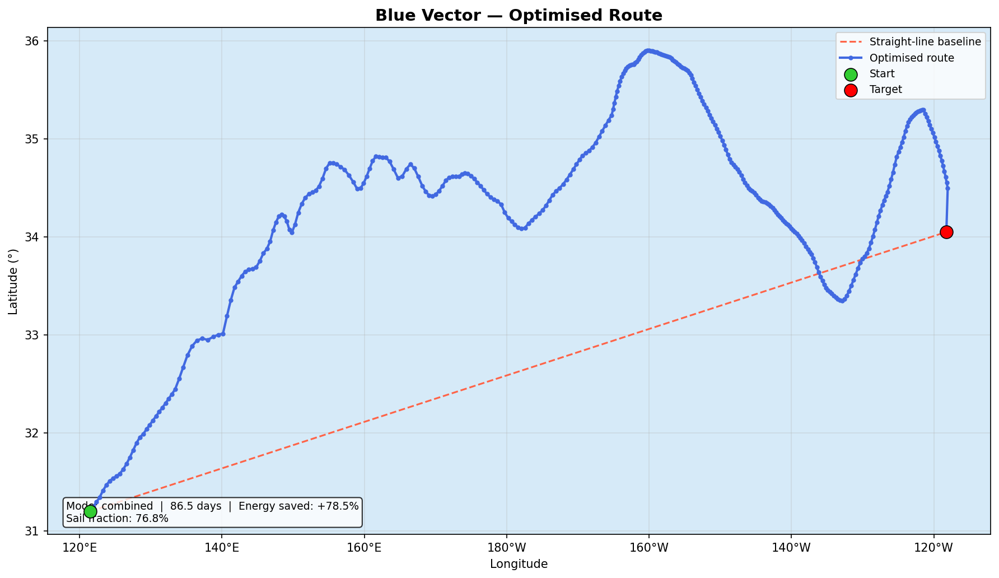

# Blue Vector

> Ocean-current-aware autonomous vessel routing — exploiting real ocean currents and wind to minimise propulsion energy across trans-oceanic routes.

---

## Demo — Shanghai → Los Angeles (10,435 km)



> Route plotted on **real NOAA RTOFS ocean current data** (fetched live via OPeNDAP, 2026-02-22).

| Metric | Value |
|--------|-------|
| Route | Shanghai, China → Los Angeles, CA |
| Distance (straight line) | 10,435 km |
| Trip duration | 86.5 days |
| Energy saved vs straight-line motor | **+78.5%** |
| Sail fraction of displacement | 76.8% |
| Mode | Combined (sail + motor steering) |

The optimised route arcs north into the North Pacific Current (Kuroshio Extension), riding the westerly winds before curving back south to Los Angeles — the same arc used by real transpacific cargo ships.

---

## How to Run

```bash
pip install -r requirements.txt

# Mock data (instant, no internet)
python main.py --mock favorable --out-plot route.png

# Compare favorable vs unfavorable currents
python main.py --mock favorable --compare

# Real NOAA RTOFS ocean current data
python main.py --download-only        # fetch and cache
python main.py --out-plot route.png   # simulate
```

---

## The Math — Technical Breakdown

### 1. Position Update (one 6-hour step)

At every timestep `Δt = 21,600 s`, the vessel position advances as the vector sum of three forces:

```
position(t+1) = position(t) + current + sail + steering
```

In Cartesian metres (east `x`, north `y`):

| Component | Formula |
|-----------|---------|
| Current   | `dx_c = u · Δt`, `dy_c = v · Δt` |
| Sail      | `dx_s = η · u_w · Δt`, `dy_s = η · v_w · Δt` |
| Steering (motor) | `dx_m = M · cos(θ) · Δt`, `dy_m = M · sin(θ) · Δt` |

Where:
- `(u, v)` — ocean current east/north velocity (m/s) from NOAA RTOFS
- `(u_w, v_w)` — wind velocity (m/s) from parametric model
- `η = 0.35` — sail efficiency (fraction of wind converted to movement)
- `M = 0.3 m/s` — max motor steering speed
- `θ` — steering angle (chosen by the optimizer each step)

Metres → degrees (spherical Earth correction):
```
Δlat = dy_total / 111,320
Δlon = dx_total / (111,320 · cos(lat))
```

---

### 2. Propulsion Energy (per step)

Only the **motor steering** costs energy — current and wind are free:

```
v_motor = √(dx_m² + dy_m²) / Δt
E_step  = v_motor² · Δt
```

This is proportional to drag power (`Force × velocity ∝ v²`). The total trip energy is `Σ E_step`.

**Baseline** (straight-line, motor only, constant speed `M`):
```
time_baseline = distance / M
E_baseline    = M² · time_baseline  =  M · distance
```

**Energy saved** = `(1 − E_trip / E_baseline) × 100%`

---

### 3. Current Favorability

How aligned is the ocean current with the direction we need to go?

```
b  = bearing to target (degrees, 0° = North)
ê  = (sin b, cos b)          ← unit vector toward target (east, north)
fav = (u · ê_x + v · ê_y) / √(u² + v²)   ∈ [−1, +1]
```

- `+1` → current flows exactly toward the target (free ride)
- ` 0` → current is perpendicular (no help, no harm)
- `−1` → current flows exactly away from target (fight it or go around)

---

### 4. Haversine Distance

Great-circle distance between two points on a sphere:

```
a = sin²(Δφ/2) + cos(φ₁) · cos(φ₂) · sin²(Δλ/2)
c = 2 · atan2(√a, √(1−a))
d = R · c        (R = 6,371,000 m)
```

---

### 5. Receding-Horizon Optimizer

At each 6-hour step, the router tries **19 candidate steering angles** (±45° around the bearing to target, every 5°) and simulates 5 days forward for each:

```
cost(θ) = Σ over horizon [
    E_step(θ)                                   # motor energy
  + β_bad · max(0, −fav)                        # penalty for bad-current lane
] + α · time_days + β · dist_remaining_km
```

The angle with the **lowest cost** is applied for the next 6 hours, then the process repeats ("receding horizon" = constantly re-planning).

**Why this works:** A current flowing toward the target reduces `dist_remaining` faster per unit of energy. The optimizer naturally routes the vessel into favourable current lanes without any explicit "find the Gulf Stream" logic — it falls out of the cost function.

---

## The Math — Explain Like You're 8

**What is Blue Vector trying to do?**
Imagine you want to cross a giant river to reach a city on the other side. The river has fast lanes and slow lanes. Blue Vector is a computer that figures out which lanes to swim through so the water does most of the work — and you barely have to kick your legs.

---

**The boat moves in three ways at once:**

1. 🌊 **The ocean current pushes it** — like the river's current. Free! No engine needed.
2. 💨 **The wind pushes the sail** — free too! The sail catches 35% of the wind speed.
3. ⚡ **The motor steers** — this costs battery. It's small (0.3 m/s) — just enough to choose which lane to be in.

Every 6 hours, the computer adds all three pushes together to find the new position.

---

**How does it choose which way to steer?**

The computer plays a little game in its head:
> *"What if I turn left? What if I turn right? What if I go straight? Let me imagine 5 days into the future for each choice and see which one gets me closest to Los Angeles using the least battery."*

It tries 19 different directions and picks the best one. Then 6 hours later, it plays the game again with updated ocean data. This is called a **receding horizon** — like always planning 5 days ahead but only committing to the next 6 hours.

---

**What is "current favourability"?**

Think of it like a score: **+1** means the ocean is pushing you straight toward your goal (great!). **0** means it's pushing sideways (meh). **−1** means it's pushing you backwards (bad — find a different lane!).

The computer steers into the +1 zones as much as possible.

---

**Why does it save ~78% energy?**

On a 10,000 km trip, the ocean current and wind do most of the pushing. The motor is only used to *choose which lane to be in* — like a tiny rudder on a big sailboat. If you went in a straight line with just the motor, you'd use ~5× more energy and take much longer.

---

## What's Real vs Mocked

| Component | Status | Detail |
|-----------|--------|--------|
| **Routing algorithm** | ✅ Real | Receding-horizon optimizer, physics, energy model — pure math, nothing faked |
| **Ocean currents** (default) | ✅ Real | Live NOAA RTOFS data fetched via OPeNDAP. Actual Pacific u/v velocities at ~90 km resolution, cached locally as NetCDF |
| **Wind model** | ⚠️ Parametric | Trade winds + westerlies by latitude/season. Correct physics, not a live NWP forecast |
| **`--mock` presets** | 🔶 Fake | Uniform constant current everywhere — for instant offline demos only. Explicitly opt-in |
| **Current time horizon** | ⚠️ Limited | RTOFS provides 24 hours of hourly data per daily run. After hour 24 the simulation holds the last current snapshot frozen in space for the remainder of the voyage |

**To run on real data:** `python main.py --out-plot route.png` (downloads and caches automatically)

**To run offline:** `python main.py --mock favorable --out-plot route.png`

---

## Architecture

```
blue_vector_claude/
├── config.py        ← all constants (timestep, weights, tolerances)
├── data_loader.py   ← NOAA RTOFS ocean current data via OPeNDAP + NetCDF cache
├── wind_model.py    ← parametric wind (trade winds + westerlies + seasonal)
├── vessel_model.py  ← physics: position update, energy, bearing, haversine
├── mock_data.py     ← offline current presets for testing
├── router.py        ← receding-horizon optimizer (19 candidates × 20 steps)
├── simulator.py     ← full route loop, arrival detection, statistics
└── viz.py           ← matplotlib trajectory + straight-line comparison
main.py              ← CLI entry point
```

---

## Data Sources

| Source | What it provides | Auth |
|--------|-----------------|------|
| [NOAA RTOFS](https://nomads.ncep.noaa.gov/) | Real-time ocean surface currents (u, v) via OPeNDAP | None (public) |
| Parametric wind model | Trade winds + westerlies by latitude/season | Built-in |
| Mock presets | Instant offline testing (favorable / unfavorable / cross / calm) | None |
